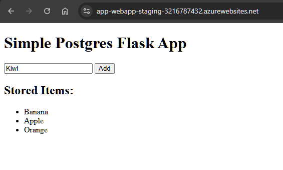
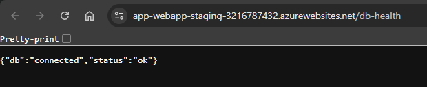

Sample web app that store and retrieve data (Python + Postgresql)
Overview:

  

DB Health check:

  

2. Containerization
- Package the application into a Docker image.
- Provide a Dockerfile to build and run the application locally.
- Run the application in a Docker container to ensure functionality.

How to run app in container:
1. Checkout code
2. 'docker login -u <username> -p <password> <container_server_url>'
3. 'docker build -t <container_server_url>/<app_name>:<app_version> .'
4. 'docker push <container_server_url>/<app_name>:<app_version>'
5. If you want to run locally use docker-compose.yml:
- 'docker-compose -f docker-compose.yml up -d' (to start)
- access app at http://localhost:5000/
- 'docker-compose -f docker-compose.yml down' (to finish)
6. 'docker push <container_server_url>/<app_name>:<app_version>'
